# Home hero section — detailed design spec

**Scope:** the Home page hero only: `src/pages/home/sections/Hero.tsx` and the flock engine it uses (`src/lib/murmuration.ts`, `src/lib/murmuration.worker.ts`). Nothing else on the site is covered.
**As built:** 28 Sep 2026.
**Measurements:**
- Taken from the production build in Chromium, on the pinned hero, at 390 × 844, 768 × 1024, 1100 × 800, 1440 × 900 and 1920 × 1080.
- Positions are in CSS px, relative to the hero **card's top-left corner** unless stated.
- Screenshots are in [`hero-design/`](hero-design/).

---

## Contents

1. [Concept](#1-concept)
2. [Anatomy and layer order](#2-anatomy-and-layer-order)
3. [Content inventory](#3-content-inventory)
4. [Layout and measurements](#4-layout-and-measurements)
5. [Typography](#5-typography)
6. [Colour](#6-colour)
7. [Components](#7-components)
8. [The flock](#8-the-flock)
9. [Scroll story](#9-scroll-story)
10. [Interactions](#10-interactions)
11. [Motion spec](#11-motion-spec)
12. [States and loading sequence](#12-states-and-loading-sequence)
13. [Accessibility](#13-accessibility)
14. [Performance](#14-performance)
15. [Implementation map](#15-implementation-map)
16. [Screenshot gallery](#16-screenshot-gallery)
17. [Open items](#17-open-items)

---

## 1. Concept

**"We're a team of builders."** The hero is a night-sky card in which thousands of small glowing birds fly as a single flock, a starling *murmuration*.

| Intent | How the hero delivers it |
|---|---|
| Show the culture (many people, one team) | Thousands of individual birds, each with its own wingbeat and path, moving as one body |
| Say what Alvyl does | The subheadline names the four services, then each service gets its own screen as the visitor scrolls |
| Feel alive and invite play | The pointer becomes a glowing sun the birds part around; a tap or click scatters the flock, and it regroups |
| Stay on brand | Only existing tokens: IvyMode + Forma DJR Micro, Alchemy red-orange, black surfaces |
| Never block anyone | Reduced motion or no WebGL → a calm static card with the same text; a Pause control; a Skip intro button |

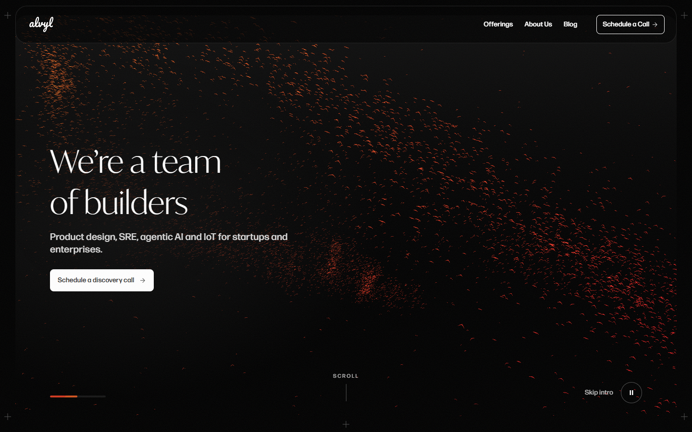

---

## 2. Anatomy and layer order

The hero is one `<section aria-label="Introduction">` holding one **card**. Layers inside the card, back to front:

| # | Layer | Element | Pointer events | Shown |
|---|---|---|---|---|
| 1 | **Sky** | card background: vertical gradient #101010 → #000000 | — | always |
| 2 | **Flock** | `<div>` holding the flock's `<canvas>` (full card, `aria-hidden`) | none | story mode; fades in when the first frame is drawn |
| 3 | **Contrast scrim** | full-card gradient (`aria-hidden`) | none | story mode |
| 4 | **Text screens** | grid of 6 stacked screens, all in the same cell; only the current one is visible | the current screen only | always (screen 1 only in the static card) |
| 5 | **Progress bar** | bottom-left | — | story mode |
| 6 | **Scroll cue** | bottom-centre (`aria-hidden`) | — | story mode, desktop, first screen |
| 7 | **Controls** | Skip intro + Pause/Play, bottom-right | yes | story mode, after the flock starts |
| 8 | **Sun** | 130 px glow following the mouse (`aria-hidden`) | none | story mode, mouse only |

```
┌──────────────────────── card (rounded 24px, overflow clipped) ─────────────────────────┐
│  [2] flock canvas — fills the card                                                      │
│  [3] scrim — darkens behind the text                        ✺ [8] sun (follows mouse)   │
│                                                                                         │
│  [4] We're a team                                                                       │
│      of builders                                                                        │
│      Product design, SRE, agentic AI and IoT for startups and enterprises.              │
│      [ Schedule a discovery call → ]                                                    │
│                                                                                         │
│  [5] ▬▬▬───────                        [6] SCROLL                [7] Skip intro  (⏸)   │
└─────────────────────────────────────────────────────────────────────────────────────────┘
```

---

## 3. Content inventory

| Screen | Element | HTML | Copy | Links to | Source |
|---|---|---|---|---|---|
| 1 | Headline | `<h1>`, two `<span>` lines | We're a team / of builders | — | `hero.titleLines` |
| 1 | Subheadline | `<p>` | Product design, SRE, agentic AI and IoT for startups and enterprises. | — | `hero.subheadline` |
| 1 | CTA | `<a>` (Button, primary) | Schedule a discovery call → | `/contact-us` | `hero.actions` |
| 2–5 | Eyebrow | `Eyebrow` | WHAT WE OFFER | — | `whatWeOffer.eyebrow` |
| 2 | Service | `<a>` with arrow | End-to-End Product Design → | `/services/product-design` | `whatWeOffer.services[0]` |
| 3 | Service | `<a>` | Site Reliability Engineering → | `/services/site-reliability` | `…[1]` |
| 4 | Service | `<a>` | Agentic AI → | `/offerings` (no own page yet) | `…[2]` |
| 5 | Service | `<a>` | IoT & Machine Learning → | `/services/iot-machine-learning` | `…[3]` |
| 6 | Invitation | `<p>` | Let's build something together | — | `hero.finale.title` |
| 6 | CTA | `<a>` (Button, primary) | Schedule a discovery call → | `/contact-us` | `hero.finale.action` |
| all | Controls | `<button>` ×2 | Skip intro · Pause/Play background animation | — | `Hero.tsx` |

All copy lives in `src/data/home.ts`. Editing it there changes the hero without touching layout code.

---

## 4. Layout and measurements

**Breakpoints** (from `src/styles/index.css`): phone < 450 px · tablet 450–1032 px · desktop ≥ 1033 px.

### 4.1 Card

| Viewport | Card (x, y on page · w × h) | Padding (top right bottom left) | Radius |
|---|---|---|---|
| 390 × 844 | 16, 16 · 358 × 812 | 0 · 24 · **96** · 24 | 24 |
| 768 × 1024 | 24, 24 · 720 × 976 | 0 · 69 · **96** · 69 | 24 |
| 1100 × 800 | 32, 32 · 1036 × 736 | 0 · 72 · 0 · 72 | 24 |
| 1440 × 900 | 32, 32 · 1376 × 836 | 0 · 72 · 0 · 72 | 24 |
| 1920 × 1080 | 142, 32 · 1636 × 1016 (page content caps at 1700 px) | 0 · 72 · 0 · 72 | 24 |

- **Height rule (story mode):** viewport height minus the side gutter above and below (`100svh − 2 × --space-side`), at least 520 px. The side gutter is 16 / 24 / 32 px for phone / tablet / desktop.
- **Side padding:** 24 px on phones, then `clamp(24px, 9vw, 72px)`.
- **Static card** (reduced motion / no WebGL): fixed height, 634 px on phones and 772 px from tablet up.
- **Vertical alignment:**
  - desktop: text centred vertically;
  - phone and tablet: text anchored to the bottom, above a 96 px bottom padding;
  - static card: centred at every size.

### 4.2 Text block (screen 1)

| Viewport | Headline (x, y · w × h) | Subheadline (x, y · w × h) | CTA (x, y · w × h) | Space below block |
|---|---|---|---|---|
| 390 | 24, 557 · 283 × 32 (one line) | 24, 605 · 310 × 48 | 24, 677 · 202 × 39 | 96 |
| 768 | 69, 574 · 342 × 164 | 69, 754 · 520 × 52 | 69, 834 · 216 × 46 | 96 |
| 1100 | 72, 211 · 357 × 172 | 72, 399 · 520 × 52 | 72, 479 · 216 × 46 | 211 (centred) |
| 1440 | 72, 261 · 357 × 172 | 72, 449 · 520 × 52 | 72, 529 · 216 × 46 | 261 (centred) |
| 1920 | 72, 351 · 357 × 172 | 72, 539 · 520 × 52 | 72, 619 · 216 × 46 | 351 (centred) |

**Spacing inside the block:**
- **Headline → subheadline:** 16 px on phones, 16 px from tablet up. The stack gap is 24 / 28 px, and the subheadline is pulled up 8 / 12 px.
- **Subheadline → CTA:** 24 px on phones, 28 px from tablet up.
- **Subheadline width:** at most 520 px.
- **Headline lines:** one line on phones ("We're a team of builders"); two lines from 450 px, broken after "team".

### 4.3 Bottom row (story mode)

| Viewport | Progress bar (x, y · w × h · gap below) | Scroll cue (x, y · w × h) | Skip intro (x, y · w × h) | Pause (x, y · w × h) |
|---|---|---|---|---|
| 390 | 24, 784 · 116 × 4 · 24 | hidden | 215, 768 · 59 × 20 | 290, 756 · 44 × 44 |
| 768 | 69, 932 · 116 × 4 · 40 | hidden | 532, 916 · 59 × 20 | 607, 904 · 44 × 44 |
| 1100 | 72, 692 · 116 × 4 · 40 | 491, 644 · 54 × 61 | 845, 676 · 59 × 20 | 920, 664 · 44 × 44 |
| 1440 | 72, 792 · 116 × 4 · 40 | 661, 744 · 54 × 61 | 1185, 776 · 59 × 20 | 1260, 764 · 44 × 44 |
| 1920 | 72, 972 · 116 × 4 · 40 | 791, 924 · 54 × 61 | 1445, 956 · 59 × 20 | 1520, 944 · 44 × 44 |

- **Left edge:** the progress bar lines up with the text's left edge.
- **Right edge:** the Pause button lines up with the card's right padding, and Skip intro sits 16 px to its left.
- **Bottom offsets:**
  - phone: progress bar 24 px from the bottom, Pause 12 px;
  - tablet up: progress bar 40 px, Pause 28 px, Scroll cue 32 px.

### 4.4 Contrast scrim

| Viewport | Gradient |
|---|---|
| Phone and tablet | `linear-gradient(to top, #101010 at 90% → transparent at 60% of the height)`, darkening behind the bottom-anchored text |
| Desktop | `radial-gradient(55% 60% at 16% 52%, #101010 at 85% → transparent at 72%)`, a soft dark pool behind the left-centred text |

### 4.5 Wireframes

**Desktop (1440 × 900, pinned):**
```
 32 ┌──────────────────────────────────── 1376 ────────────────────────────────────┐
    │                                                                              │
    │ 72                                                                           │ 836
261 │ ├─ We're a team                       (flock fills the whole card)           │
    │ │  of builders            357×172                                            │
449 │ │  Product design, SRE, agentic AI…   520×52                                  │
529 │ │  [Schedule a discovery call →]      216×46                                  │
    │                                                                              │
792 │ ▬▬▬──── 116×4             SCROLL │ (54×61)            Skip intro  (⏸ 44)     │
    └──────────────────────────────────────────────────────────────────────────────┘
```

**Phone (390 × 844, pinned):**
```
 16 ┌──────── 358 ────────┐
    │   (flock, weighted   │
    │    to the top)       │ 812
557 │ We're a team of builders
605 │ Product design, SRE, agentic
    │ AI and IoT for startups and…
677 │ [Schedule a discovery call →]
    │                      │  96 px padding
784 │ ▬▬▬───  Skip intro (⏸) │
    └──────────────────────┘
```

---

## 5. Typography

Values are the browser's computed values.

| Element | Family | Weight | Size (phone / tablet / desktop) | Line height | Tracking | Colour |
|---|---|---|---|---|---|---|
| Headline `h1` | IvyMode (Light) | 300 | 28 px / `clamp(40px, 8.1vw, 65px)`, 62.2 px at 768 / 65 px | 32 px / 1.32 (82.1 / 85.8 px) | normal | #FFFFFF |
| Service name | IvyMode | 300 | same as headline | 32 px / 1.2 | normal | #FFFFFF |
| Invitation (screen 6) | IvyMode | 300 | same as headline, max width 560 px | 32 px / 1.2 | normal | #FFFFFF |
| Subheadline | Forma DJR Micro (Medium) | 500 | 16 / 18 / 20 px (`--fs-body-lg`) | 24 / 26 / 26 px | normal | #D6D6D6 |
| CTA label | Forma DJR Micro | 500 | 14 px | 1 | normal | #333333 |
| Eyebrow | Forma DJR Micro, uppercase | 500 | caption token | caption token | 0.08em | #B5B5B5, whole eyebrow at 80% opacity |
| Scroll cue | Forma DJR Micro, uppercase | — | 11 px | — | 0.2em | #B5B5B5 |
| Skip intro | Forma DJR Micro | — | 14 px | — | normal | #B5B5B5 → #FFFFFF on hover |

**Fonts:** IvyMode Light and Forma DJR Micro Medium are preloaded and use `font-display: swap`, so text shows immediately in a fallback font and switches when the brand font arrives.

---

## 6. Colour

The hero adds no new colours.

| Role | Token | Value |
|---|---|---|
| Sky, top | `--color-sky-top` | #101010 |
| Sky, bottom | `--color-sky-bottom` | #000000 |
| Birds, gradient start | `--color-alchemy-1` | #CE521D (orange) |
| Birds, gradient end | `--color-alchemy-2` | #CE1D1E (red) |
| Birds lit by the sun / a tap | `--color-text-light` | #D6D6D6 |
| Headline, service names | `--color-text-white` | #FFFFFF |
| Subheadline | `--color-text-light` | #D6D6D6 |
| Eyebrow, Scroll cue, Skip intro | `--color-text-ultra-light` | #B5B5B5 |
| CTA fill / label | `--color-btn-primary` / `--color-btn-primary-text` | #FFFFFF / #333333 |
| CTA pressed | `--color-text-light` | #D6D6D6 |
| Pause ring | `--color-stroke-dark` → white on hover | #4E4E4E → #FFFFFF |
| Scroll cue track / moving line | `--color-stroke-dark` / `--alchemy-gradient` | #4E4E4E / Alchemy |
| Progress track / thumb | `--color-stroke-very-light` / Alchemy | #161616 / Alchemy |

**How the birds are coloured:**
- **Colour:** the Alchemy gradient runs diagonally across the screen, orange at top-left to red at bottom-right, so the flock's colour shifts as it moves.
- **Blending:** birds are drawn additively, so dense parts glow brighter.
- **Nearness:** each bird's opacity depends on its depth, so near birds read stronger.

---

## 7. Components

### 7.1 Headline
- One `<h1>` with a `<span>` per line. From tablet up, each line is `display: block` so the break after "team" is fixed.
- **Entrance:** each line rises 0.35em into place, the second line 120 ms after the first.
  - It's a transform only; the headline is never at zero opacity or masked.
  - It's readable in the first frame and is the page's Largest Contentful Paint.
  - On phones the whole headline rises as one.

### 7.2 Subheadline
- A `<p>`, max width 520 px, #D6D6D6, body-lg size.
- **Entrance:** fades up 24 px, 350 ms after the headline starts.

### 7.3 Primary CTA (design-system `Button`, variant primary, size `responsive`)

| Property | Phone | Tablet and desktop |
|---|---|---|
| Size | 202 × 39 px (hit area stretched to at least 44 × 44) | 216 × 46 px |
| Padding / gap | 12 px / 4 px | 16 px / 10 px |
| Radius | 8 px | 8 px |
| Fill / label | #FFFFFF / #333333 14 px Medium | same |
| Trailing arrow | yes | yes |

| State | Look |
|---|---|
| Default | white fill |
| Hover (mouse) | the label rolls up and back in, the arrow nudges forward (site-wide button motion) |
| Pressed | fill #D6D6D6 |
| Keyboard focus | the site's focus ring |

**Entrance:** fades up 24 px, 500 ms after the headline starts.

### 7.4 Service screens (2–5)
- **Eyebrow:** a 12 px red dot plus "WHAT WE OFFER". Each time the screen appears, its letters decode from random glyphs, left to right, over 700 ms.
- **Service name:** a link in headline type, max width 640 px.
  - A 32 px arrow follows the last word; the last word and arrow never wrap apart.
  - On hover the arrow slides 4 px right (300 ms).

### 7.5 Invitation screen (6)
- "Let's build something together" in headline type (max width 560 px), with the same primary CTA.

### 7.6 Progress bar (design-system `ProgressIndicator`)
- **Track:** 116 × 4 px, #161616.
- **Thumb:** 57 px Alchemy gradient.
- **Movement:** the thumb slides from left to right across the whole story, following scroll position continuously rather than jumping per screen. No numbers.

### 7.7 Scroll cue
- **Look:** "SCROLL" (11 px caps) above a 1 × 36 px track, with an Alchemy line that keeps drawing downward every 2 s.
- **When it shows:** desktop only, once the flock has started. It fades out over 500 ms as soon as the visitor leaves screen 1.

### 7.8 Skip intro
- A text button (14 px, #B5B5B5, white on hover).
- It glides the page to the end of the hero, straight to the "Why we exist" section, using the site's smooth scroll.

### 7.9 Pause / Play
- **Look:** a 44 × 44 px round button with a 1 px #4E4E4E ring, white icon, and a white ring plus 5% white fill on hover.
- **Icon:** pause bars while playing, a play triangle while paused.
- **Accessibility:** the label switches between "Pause background animation" and "Play background animation", with `aria-pressed`.

### 7.10 Sun pointer
- **Look:** 130 × 130 px, centred on the mouse, with no regular shape.
  - **Centre:** a white-hot glow (white 0–6%, warming into Alchemy orange by 14%) inside a soft orange-red halo, a little off-centre.
  - **Core:** on top, a lumpy white blob.
  - **Rays:** up to 10 tapered orange-red light rays, softly blurred.
- **Motion:** random and never repeating, drawn live by `src/lib/sun.ts`.
  - The core's 9 edge points drift toward new random radii, and the core wanders slightly off-centre.
  - Each ray is born at a random angle, length, width and strength, flares up, fades out over 0.7–2.8 s and is replaced.
  - The halo's outline and the sun's size (0.94–1.1×) drift toward new random targets.
  - It animates only while the sun is showing.
- **The hole it makes in the flock** is random too: see `hero-motion-patterns.md` §2.3.
- **When it shows:**
  - it replaces the cursor over the sky of the card (`cursor: none`) for **mouse** pointers only;
  - over text, links and buttons it shrinks into the pointer (scale 0.15, fading, 200 ms) and the normal cursor takes over: a hand on links and buttons, the text cursor on copy. Back on the sky it grows out of the pointer again;
  - it fades out in 300 ms when the mouse leaves the card, and the normal cursor returns everywhere else.
- **Brightness:** the whole sun is drawn at 85% (`filter: brightness(0.85)` on `.sun`).

---

## 8. The flock

### 8.1 Rendering
- **One draw call.** All birds are drawn as WebGL points; each bird's position is computed on the GPU every frame.
- **Main-thread work.** Per frame, the page's main thread only updates a few numbers: time, scroll position, pointer.
- **Where it draws:** in a **Web Worker** on an `OffscreenCanvas`, so it never delays scrolling, taps or paint. Where the browser can't do that, it draws on the page instead.
- **Resolution:** device pixel ratio, capped at 2 on desktop and 1.5 on phones and tablets.

### 8.2 Birds

| Property | Value |
|---|---|
| Count | 10,000 on desktop · 5,000 on phones and tablets · halved on machines with 4 or fewer CPU cores |
| Shape | A tiny bird seen from below: two tapered, swept-back wings and a small body, drawn inside each point |
| Size | 6.5 px (desktop) or 5.5 px, × device pixel ratio, × a random 0.6–1.4 per bird, × perspective (near birds larger) |
| Wingbeat | Each bird flaps at its own rate, 8–13 beats per 2π seconds (about 1.3–2 flaps a second) |
| Heading | Birds bank slightly as the flock turns |
| Opacity | 0.25–0.6 by depth, × 1.6 hero brightness, × up to 2 when lit |
| Flutter | Each bird jitters slightly on its own |
| Stragglers | 6% of birds drift loose across the whole card, away from the flock |

### 8.3 Flock structure
- **Three flocks** follow the same wandering leader path, spaced out in time along it, so the whole card is alive at once.
- **Body along the path:** each bird has a fixed place in its flock's body (along, across, depth). The body is laid along the leader's recent path, so every turn of the leader sweeps through the whole flock like a real murmuration.
- **Shape of the body:**
  - it tapers at both ends and breathes wider and narrower;
  - it twists along its length into folding sheets;
  - density waves ripple through it.
- **Birds are denser** toward the middle of the body and its centre line.

### 8.4 Camera and framing
- **Camera:** 35° field of view, looking at the flock from 10 units away.

| Viewport | Flock scale | Offset |
|---|---|---|
| Desktop (≥ 1033 px) | fills the card edge to edge, behind the headline | centred |
| Phone and tablet | slightly larger, filling the card | shifted up 20% toward the space above the text |

### 8.5 Flight styles (one per screen)

| Screen | Style | Body length (s) | Width | Twist | Split | Ball | Speed |
|---|---|---|---|---|---|---|---|
| 1 Headline | long ribbon | 16 | 0.75 | 5 | 0 | 0 | 1.0 |
| 2 Product Design | wide folding sheet | 10 | 1.2 | 9 | 0 | 0 | 0.8 |
| 3 SRE | two flocks | 12 | 0.65 | 5 | 1 | 0 | 1.1 |
| 4 Agentic AI | dense, swirling ball | 6 | 0.75 | 4 | 0 | 1 | 0.7 |
| 5 IoT & ML | long stream | 22 | 0.5 | 3 | 0 | 0 | 1.3 |
| 6 Invitation | ribbon again | 14 | 0.8 | 5 | 0 | 0 | 0.9 |

What each parameter does:
- **Body length:** how many seconds of the leader's path the body covers; longer means a more stretched ribbon.
- **Width:** cross-section size.
- **Twist:** how much the body twists along its length.
- **Split:** 1 divides each flock in two.
- **Ball:** 1 gathers the flock into a swirling sphere.
- **Speed:** how fast the flock flies.

Between two screens every parameter blends smoothly, and the flock eases toward the new style, so changes never snap.

---

## 9. Scroll story

### 9.1 Structure
- **Section height:** 400% of the viewport height (`400svh`). The card inside it is sticky, 32 px from the top on desktop, so it stays on screen for the pinned range.
- **Pinned range:** section height minus card height. At 1440 × 900 that's **2,764 px**, or **553 px per screen change**, across 6 screens.

### 9.2 Mapping from scroll to screen
1. `q` = how far through the pinned range the visitor is (0 … 1). This drives the **progress bar** directly.
2. `s = q × 5` (0 … 5 across the six screens).
3. The story is **continuous**: the flock's flight style follows `s` directly (no holds), easing toward it per frame so it never snaps.
4. The **text is scrubbed by scroll.** For screen `i`, `d = s − i`: fully shown while |d| ≤ 0.2, fading out (smoothstep) by |d| = 0.56, and always drifting upward by 56 px per screen change, so it rises in from below and lifts away above as the visitor scrolls. At each midpoint the two neighbours overlap faintly (about 6% each). The current screen (links, eyebrow decode, `inert`) is the nearest one, `round(s)`.

### 9.3 Timeline at 1440 × 900 (page scroll position, px)

> Since the story became continuous (§9.2), the flock no longer holds: read "Holds" and "Blends" below as where each style is strongest and where it hands over. Each screen's text is fully shown in the middle 40% of its step and centred on its screen position (0, 553, 1,106 … 2,764).

The hero **starts already pinned**. The section is pulled up by the header's height plus the gap below it (110 px, `story:-mt-[110px]`), so from the first frame the card sits at the side padding with the floating header over its top. Scrolling never moves the card until the story ends. The pinned range runs from 0 to 2,764.

| Screen | Holds (flock style fixed) | Blends to next | Text shows |
|---|---|---|---|
| 1 Headline | 0 → 166 | 166 → 387 | 0 → 276 |
| 2 Product Design | 387 → 719 | 719 → 940 | 276 → 829 |
| 3 SRE | 940 → 1,272 | 1,272 → 1,493 | 829 → 1,382 |
| 4 Agentic AI | 1,493 → 1,825 | 1,825 → 2,046 | 1,382 → 1,935 |
| 5 IoT & ML | 2,046 → 2,378 | 2,378 → 2,599 | 1,935 → 2,488 |
| 6 Invitation | 2,599 → 2,764 | — | 2,488 → 2,764 |

After 2,764 px the card un-pins and the "Why we exist" section scrolls up. The static reduced-motion card is not pulled up; it sits in its normal place below the header.

### 9.4 Text transitions
- **Scroll-driven:** opacity and position come from the scroll position (§9.2), with an 180 ms linear smoothing so mouse-wheel steps glide. Screens other than the current one are `inert` (not focusable, not read).
- **Eyebrows:** they decode each time their screen appears.

---

## 10. Interactions

Distances are given in flock units and in **px at 1440 × 900**, where 1 unit ≈ 133 px.

### 10.1 Sun and falcon (mouse)

| Effect | Rule | Size at 1440 |
|---|---|---|
| Birds flee the pointer | Pushed away from it, fading with distance (1/e at 0.71 units), up to 0.8 units, and a little toward the viewer | a hole about **94 px** in radius, birds moved up to **~106 px** |
| Birds near the sun light up | Colour mixes up to 70% toward #D6D6D6 and opacity rises up to 2× (1/e at 2 units) | a glow about **265 px** around the sun |
| Smoothing | The flock's idea of the pointer follows it smoothly, so the hole glides rather than jumps | — |
| Hole closing | When the pointer leaves the card, the effect fades out | — |

### 10.2 Tap or click to scatter

| Property | Rule | At 1440 |
|---|---|---|
| Trigger | `click` on the card, not on a link or button. On phones a tap triggers it, but starting a scroll never does. | — |
| Spread | The shock travels outward at 8 units/s, so near birds react first | ~**1,060 px/s** |
| Strength over time | Rises and falls: peaks at **0.28 s**, mostly gone by ~2 s | — |
| Reach | Fades with distance (1/e at 4.2 units), so most of the card reacts, most strongly near the tap | ~**560 px** |
| Push | Up to 2.2 units outward, with a random sideways swirl (±0.6×), plus depth (toward or away from the viewer) | up to ~**290 px** |
| Variety | Each bird's push is scaled by a random 0.6–1.4 | — |
| Light | Scattered birds flash toward #D6D6D6 (60% of the burst's strength) | — |
| Scaling | On cards taller than they are wide (phones), reach and push shrink with the card's width, so a tap feels the same | — |
| Repeat | A new tap restarts the burst from the new point | — |
| While paused | No effect (rendering is stopped) | — |

### 10.3 Other interactions

| Input | Result |
|---|---|
| Scroll / swipe | Moves through the six screens (§9) |
| Skip intro | Smooth scroll to the end of the hero |
| Pause / Play | Stops or restarts all flock rendering; the flock freezes in place |
| Hover a service name | Arrow slides 4 px right |
| Keyboard Tab | Header links → hero CTA (current screen) → Skip intro → Pause → next section |
| Touch devices | No sun; tap-to-scatter and all controls work |

---

## 11. Motion spec

| # | Moment | What moves | From → to | Duration | Easing | Delay | Trigger |
|---|---|---|---|---|---|---|---|
| 1 | Headline lines | transform | translateY(0.35em) → 0 | 1.1 s | reveal: cubic-bezier(0.16, 1, 0.3, 1) | 0 / 120 ms | page load |
| 2 | Subheadline | opacity, transform | 0, translateY(24px) → 1, 0 | 1.1 s | reveal | 350 ms | page load |
| 3 | CTA | opacity, transform | 0, translateY(24px) → 1, 0 | 1.1 s | reveal | 500 ms | page load |
| 4 | Flock | opacity | 0 → 1 | 1.5 s | ease | — | first frame drawn |
| 5 | Screen out | opacity, transform | 1, 0 → 0, −31 px | follows scroll (180 ms smoothing) | smoothstep | — | scroll |
| 6 | Screen in | opacity, transform | 0, +31 px → 1, 0 | follows scroll (180 ms smoothing) | smoothstep | — | scroll |
| 7 | Eyebrow decode | text | random glyphs → label, left to right | 700 ms | linear | — | screen appears |
| 8 | Flight style | flock parameters | blend between neighbouring styles | follows scroll continuously, eased per frame | easing | — | scroll |
| 9 | Scroll cue line | transform | −100% → 100% | 2 s loop (moves in the first 60%) | reveal | — | continuous |
| 10 | Scroll cue exit | opacity | 1 → 0 | 500 ms | ease | — | leaving screen 1 |
| 11 | Sun follow | position | follows the mouse directly | — | — | — | mouse move |
| 12 | Sun breathe | scale, opacity | 1 → 1.08, 0.9 → 1 | 3.2 s loop | ease-in-out | — | continuous |
| 13 | Sun show / hide | opacity | 0 ↔ 1 | 300 ms | ease | — | mouse enters / leaves |
| 14 | Falcon hole | bird positions | pushed out, closes behind | eased per frame | — | — | mouse move |
| 15 | Tap scatter | bird positions, colour | burst out → regroup | ~2 s (peak 0.28 s) | rise and fall | spreads 8 units/s | click / tap |
| 16 | Service arrow | transform | 0 → 4 px right | 300 ms | ease | — | hover |

**Reduced motion:** motions 1–3 and 12 don't play (the `motion-safe` classes are skipped), and there is no flock, no pinning, no sun and no scroll cue.

---

## 12. States and loading sequence

### 12.1 Loading sequence (story mode)
1. **Before first paint:** an inline script in `index.html` adds the `story` class to `<html>` if motion is allowed and WebGL exists. The pinned layout is therefore in place from the first frame, with no layout shift.
2. **First paint:** the prerendered hero shows on the night sky. The headline, subheadline and CTA are real HTML and readable immediately, and the CTA link works.
3. **After the first frame:** the page's JavaScript starts loading.
4. **Hydration:** React attaches. The hero creates the flock container and hands the canvas to the worker.
5. **Worker:** creates the WebGL context and draws the first frame, then tells the page.
6. **Flock appears:** fades in over 1.5 s. The Pause and Skip controls and the Scroll cue appear at the same moment.

### 12.2 States

| State | Flock | Text | Controls |
|---|---|---|---|
| Story, playing | flying, reacting to scroll, pointer and taps | current screen | shown |
| Story, paused | frozen where it was | still changes with scroll | Play icon shown |
| Hero off screen | stops rendering (no GPU use) | — | — |
| Browser tab hidden | stops rendering | — | — |
| Static (reduced motion) | none | screen 1 only, centred in a 634 / 772 px card | none |
| WebGL unavailable or fails in the worker | none (switches to static) | screen 1 only | none |
| No OffscreenCanvas | flies, drawn on the page's main thread | same as story | shown |

---

## 13. Accessibility

| Requirement | How it's met |
|---|---|
| Reduced motion | No pinning, flock, sun, scroll cue or entrance motion; static card |
| Pause moving content (WCAG 2.2.2) | Pause/Play button, labelled, with `aria-pressed` |
| Only the visible screen is reachable | Hidden screens are `inert` (not focusable, not announced) |
| Decorative layers ignored | Flock, scrim, sun and scroll cue are `aria-hidden` |
| Landmark | `<section aria-label="Introduction">` containing the page's only `<h1>` |
| Contrast | #FFFFFF and #D6D6D6 on #101010–#000000, with the scrim behind the text |
| Touch targets | CTA hit area ≥ 44 × 44 px; Pause 44 × 44 px; **Skip intro 59 × 20 px (below target, see §17)** |
| Keyboard | Every control and link reachable in order; the site's focus ring |
| Cursor | The system cursor is only replaced over the hero card, for mouse users |

---

## 14. Performance

| Measure | Result (Lighthouse 12, production build) |
|---|---|
| Mobile performance | 96–98 across runs |
| Desktop performance | 100 |
| Total blocking time (mobile) | 10–150 ms (was 1,810 ms before the flock moved to a worker) |
| Layout shift | 0 |
| Largest Contentful Paint element | the hero `<h1>` |

**Why it's fast:**
- **Flock off the main thread:** the flock runs in a Web Worker on an `OffscreenCanvas`. Creating the WebGL context (about 340 ms at 4× CPU throttling) and drawing every frame no longer block the page.
- **Headline painted immediately:** it's prerendered and never hidden by its entrance animation.
- **JavaScript after first paint:** it loads only after the first frame, so it doesn't compete with the HTML and fonts.
- **Rendering stops when unseen:** while the hero is off screen or the tab is hidden.
- **Fewer birds on phones** and low-core machines.

---

## 15. Implementation map

| File | Responsibility |
|---|---|
| `src/pages/home/sections/Hero.tsx` | Layout, the six screens, scroll-to-screen mapping, sun, tap-to-scatter, Skip, Pause, progress |
| `src/lib/murmuration.ts` | Shaders (bird shape, flight, falcon, burst), flight styles, the renderer (`createFlockRenderer`), and the page-side wrapper (`createMurmuration`) |
| `src/lib/murmuration.worker.ts` | Runs the renderer in a Web Worker on the transferred canvas |
| `src/data/home.ts` | Copy: `hero` (headline, subheadline, actions, finale) and `whatWeOffer.services` |
| `src/styles/index.css` | Sky tokens, breakpoints, type tokens, `rise` animation |
| `src/styles/motion.css` | `.sun`, `.scroll-cue` |
| `index.html` | `story` flag before first paint |
| `scripts/prerender.mjs` | Loads the app script after first paint |

**`createMurmuration` options:**

| Option | Hero value |
|---|---|
| `container` | the sky `<div>` |
| `colors` | Alchemy 1, Alchemy 2, text-light |
| `glow` | 1.6 |
| `layout` | 'hero' |
| `onReady` | fade in |
| `onError` | switch to the static card |

**Methods:** `setProgress`, `setActive`, `setPaused`, `burst(x, y)`, `destroy`.

---

## 16. Screenshot gallery

| | |
|---|---|
|  Screen 1 — headline (1440) | 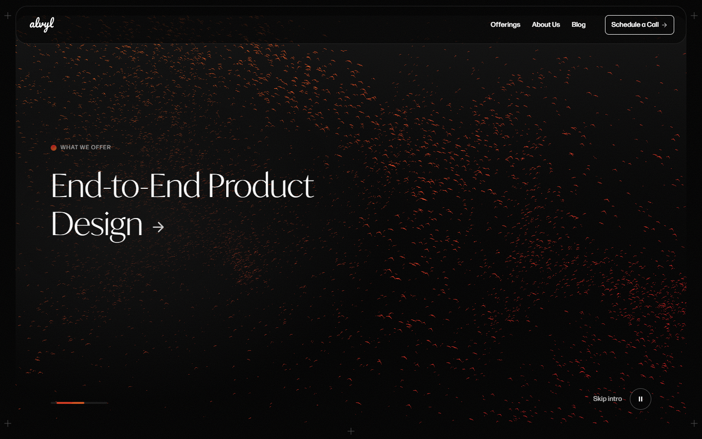 Screen 2 — Product Design, folding sheet |
| 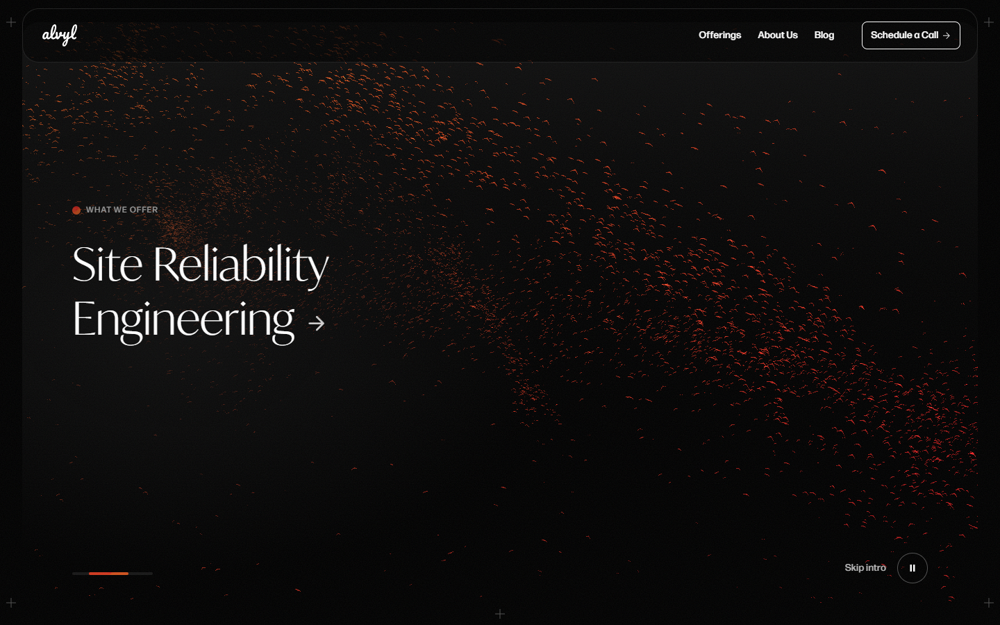 Screen 3 — SRE, two flocks | 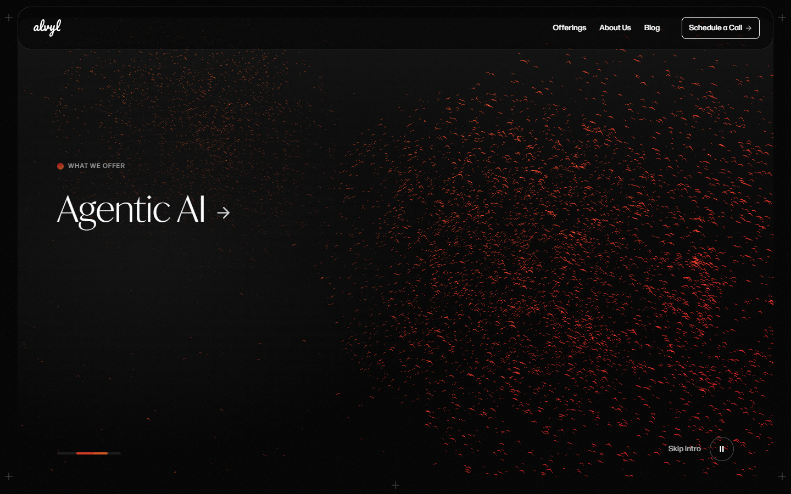 Screen 4 — Agentic AI, swirling ball |
| 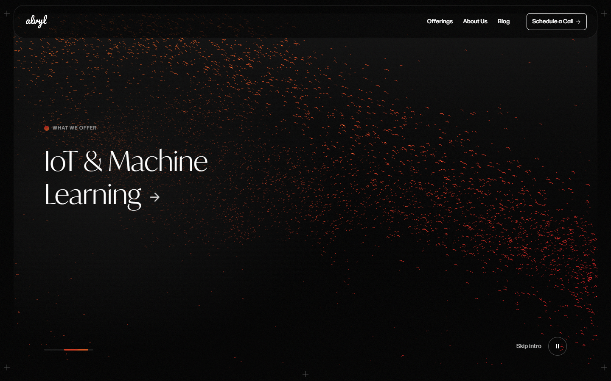 Screen 5 — IoT & ML, long stream | 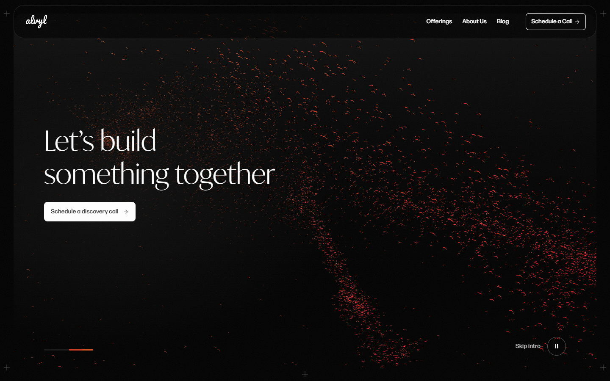 Screen 6 — invitation |
| 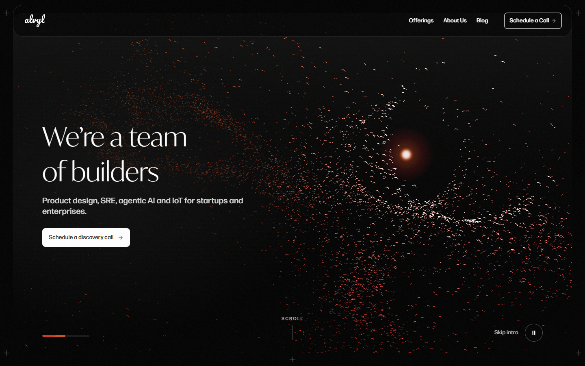 Sun pointer, falcon hole and lit birds | 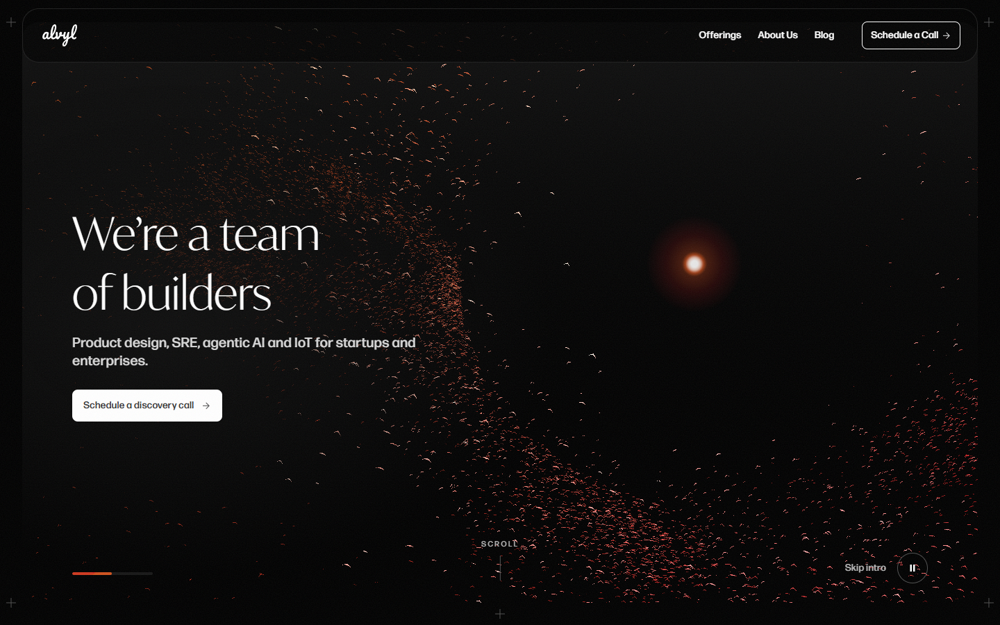 Tap-to-scatter, 0.3 s after the click |
| 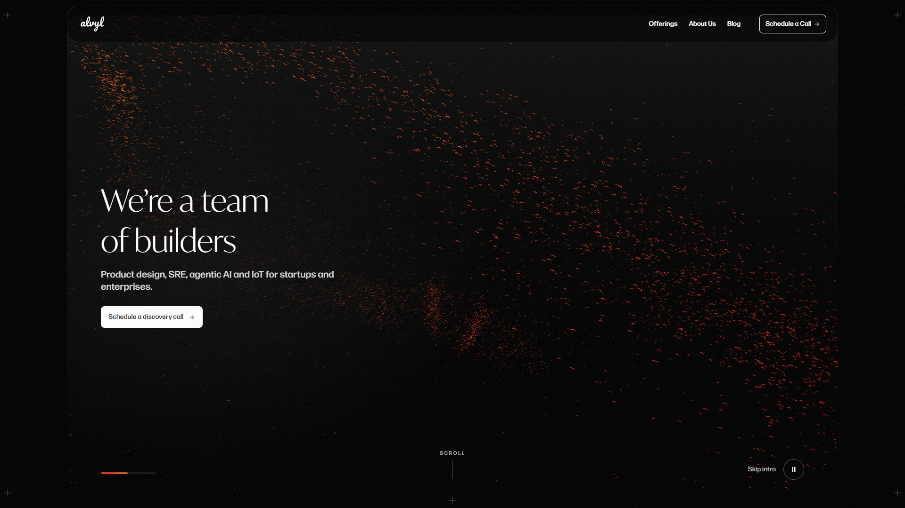 1920 × 1080 | 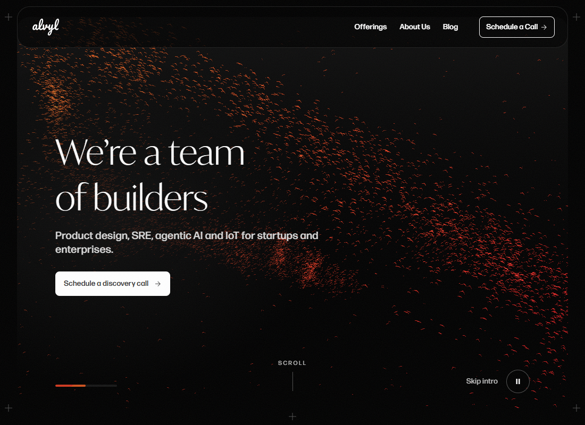 1100 × 800 |
| 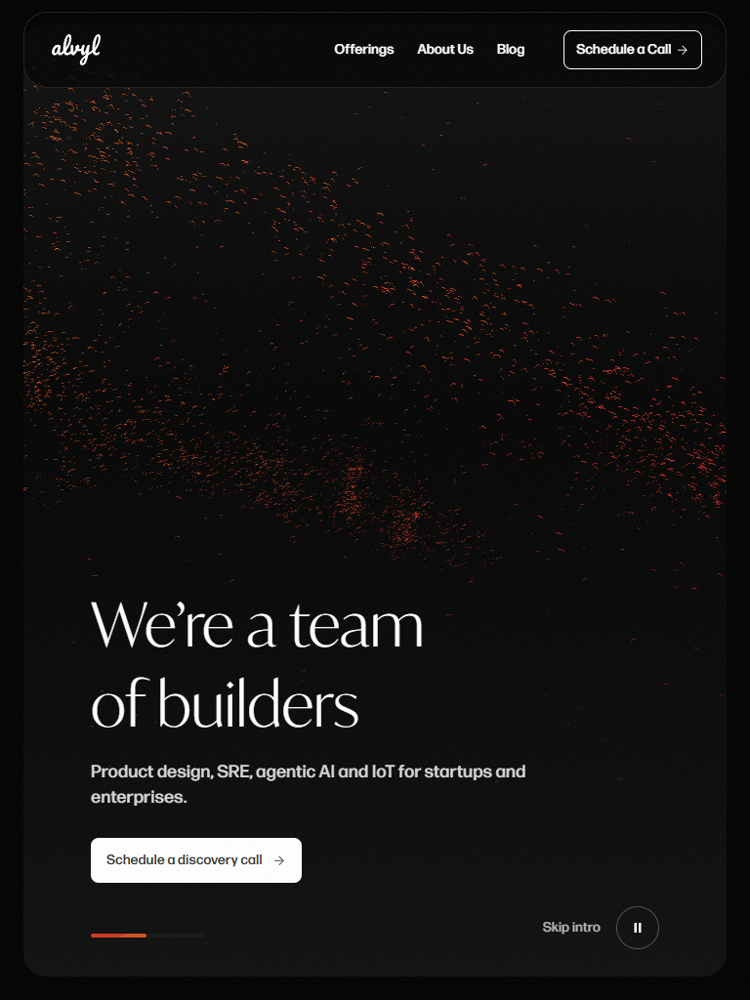 768 × 1024 (tablet) | 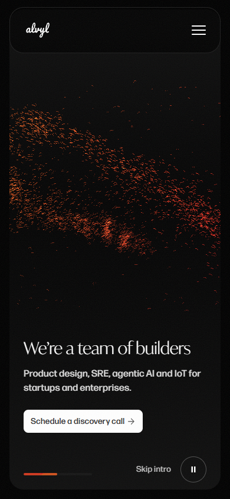 390 × 844 (phone) |
| 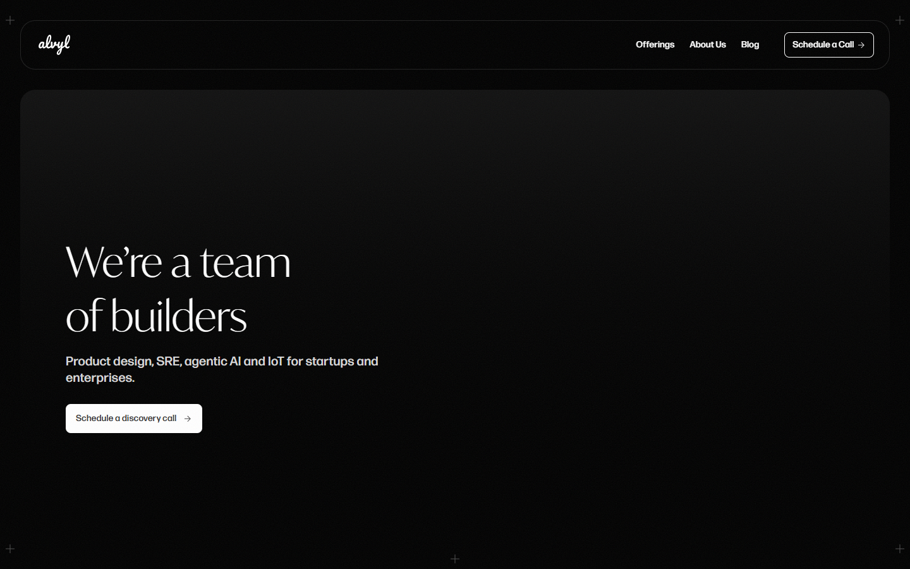 Static card, reduced motion (1440) | 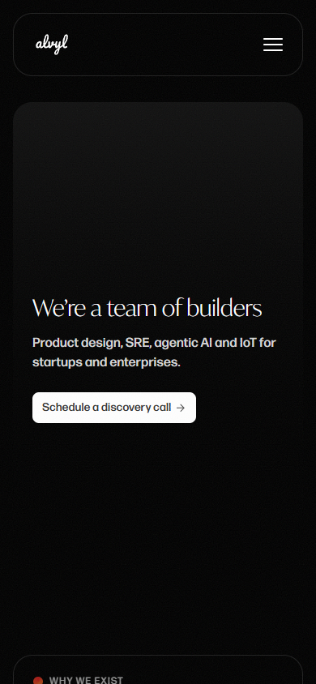 Static card, reduced motion (390) |

`hero-design/load-*.png` were captured before the hero started pinned, so they show the old first-load view with the card below the header. The page now opens in the pinned view shown by `pinned-*.png`.

---

## 17. Open items

| # | Issue | Suggested fix |
|---|---|---|
| 1 | Pause stops all rendering, so a paused visitor sees a frozen flock while the text keeps changing | Render one still frame when the scroll position changes while paused |
| 2 | The sun is drawn above the text and buttons: it can cover the CTA label, and over buttons the native pointer shows too | Put the sun below the text layer, or shrink and fade it over links and buttons |
| 3 | Skip intro is 59 × 20 px, under the 44 × 44 px touch target | Add padding to at least 44 px tall |
| 4 | Tap-to-scatter has no hint, so visitors find it by chance | A one-time hint ("Tap the sky") that fades after the first interaction |
| 5 | Keyboard focus on Skip intro can scroll the page and move the story forward | Keep the controls from being scrolled into view on focus |
| 6 | A steady mobile 99 needs the brand fonts subset (check the licences) or a fallback-first font strategy | Product owner's decision |
